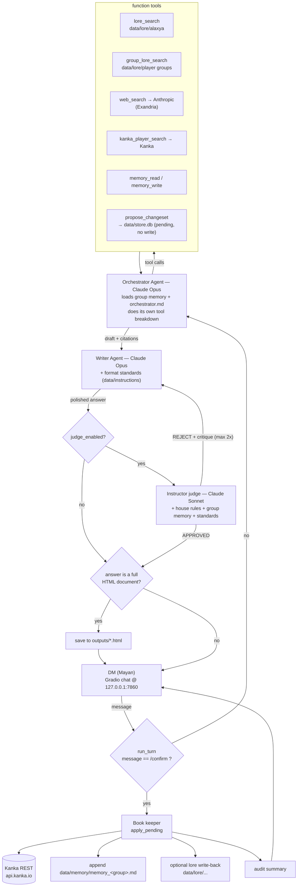

# DM Helper

Single-user Dungeon Master assistant for Mayan. One Orchestrator agent + function tools, an explicit Writer and Instructor judge loop, and confirmation-gated Kanka writes. **Anthropic Claude only**, routed through LiteLLM on the OpenAI Agents SDK. Kanka REST is the canonical campaign store; lore is whole-file markdown (no RAG, no embeddings).

## Worlds & sources (kept separate)

- **Alaxya** — Mayan's homebrew world. Local markdown in `data/lore/alaxya/` (Deities, History, Geography, the Seven Espada). Read by `lore_search`. Never the web.
- **Player groups** — one backstory file per group in `data/lore/player groups/` (e.g. `Noir_ Players.md`). Read by `group_lore_search`.
- **Exandria** — Critical Role setting. Pulled from the web via Anthropic's native `web_search`. Never mixed with Alaxya.

## Stack

- Python 3.11+, managed with [uv](https://docs.astral.sh/uv/)
- `openai-agents[litellm]` — agent framework, `Runner`, `SQLiteSession`
- `anthropic` SDK — native `web_search` server tool
- `gradio` — local chat UI
- `httpx` + `tenacity` — Kanka client (429-aware backoff)
- `pydantic` + `pydantic-settings` — typed config + changeset validation
- `python-frontmatter` — Alaxya lore category tags

Every model call routes to Claude via `LitellmModel`. Tracing is **disabled by default** at import; it turns on only if you set `OPENAI_API_KEY` (used solely to upload traces to your OpenAI dashboard — not for any model call).

## Flow



Conversation history per `group:chat` persists in `data/sessions.db` via `SQLiteSession`, resumable across restarts.

## How a turn flows (text)

1. **`/confirm`** short-circuits everything → the book keeper applies the queued Kanka changeset (see below) and returns an audit summary.
2. Otherwise the **Orchestrator** (Claude Opus) loads the active group's rolling memory + `prompts/orchestrator.md`, decides which tools to call, and produces a cited draft.
3. The draft goes to the **Writer** (Claude Opus, no tools), which polishes it for the table. The Writer also carries the conditional output-format standards (session document / feat HTML).
4. If `DMHELPER_JUDGE_ENABLED=true` (default), the **Instructor** (Claude Sonnet) reviews the draft against `prompts/instructions.md`, the format standards, **and the group's rolling memory** (so it can reject answers that contradict established canon). On `REJECT` the Writer re-runs with the critique — max 2 iterations.
5. If the final answer is a complete HTML document (session write-up or feat), it is saved to `outputs/` with a filename derived from its `<title>`.

## Kanka write gate

The Orchestrator never writes to Kanka directly. It calls `propose_changeset(group_id, chat_id, items_json)`, which validates items and queues them in `data/store.db` (`pending_changes`), then tells Mayan: `Reply "/confirm" to save`. **Nothing reaches Kanka until `/confirm`.**

On `/confirm`, the book keeper, per item:

1. Looks up `(group_id, local_key)` in `kanka_id_map`. If found → `PUT /<entity_type>/<id>` (no search).
2. Else searches Kanka by name; exact match → update + cache the id.
3. Else creates the entity + caches the id.
4. If the item set `lore_target`, writes the content back into `data/lore/alaxya/` (one file per entity) or appends to the group's `data/lore/player groups/` file.
5. Appends a `## /confirm <timestamp>` block to `data/memory/memory_<group>.md` — the same memory the Orchestrator and Instructor read.

The long-term goal is to drive all markdown content into a fully-populated Kanka site, gated by Mayan's `/confirm`.

## Memory model

One rolling memory file per group: `data/memory/memory_<group>.md`.

- **Written by** the book keeper on `/confirm`.
- **Read by** the Orchestrator (into its instructions each turn) and the Instructor (to check drafts against canon).

## Setup

```bash
uv sync --all-extras
cp .env.example .env
# fill ANTHROPIC_API_KEY, KANKA_API_TOKEN, KANKA_CAMPAIGN_ID
# optional: OPENAI_API_KEY to enable trace export
```

`web_search` must be enabled for your Anthropic organisation in the Claude Console (Privacy settings).

## Run

```bash
uv run python app.py
```

Gradio launches on `http://127.0.0.1:7860`. The group dropdown is derived from `data/lore/player groups/`. **New chat** starts a fresh `SQLiteSession` for the selected group.

## Tests

```bash
uv run pytest
```

Covers: Kanka client (search/list/create, 429 backoff, give-up, non-429 errors), memory tool, verdict parser, lore tools (group-file matching, Alaxya/group write-back), the write gate (unconfirmed write blocked, search-before-write dedupe, cached-id short-circuit, memory append), HTML output emission, and the format-standards / group-memory injection into the Writer and Instructor.

## Layout

```
app.py                         # Gradio entry; configures tracing
src/dmhelper/
    config.py                  # pydantic-settings (.env)
    observability.py           # optional OpenAI trace export
    orchestrator.py            # per-turn pipeline (orchestrator->writer->judge->html)
    outputs.py                 # detect + save HTML session docs to outputs/
    agents/
        writer.py
        instructor.py
        format_standards.py    # loads data/instructions/*.md
    tools/
        lore.py                # lore_search, group_lore_search, lore write-back
        web.py                 # Anthropic web_search wrapper
        kanka_search.py        # kanka_player_search
        kanka_write.py         # propose_changeset + apply_pending (book keeper)
        memory.py              # memory_read / memory_write
    clients/kanka.py           # async httpx + tenacity
    store/db.py                # pending_changes + kanka_id_map (SQLite)
data/
    lore/alaxya/               # Alaxya world lore (frontmatter category/world)
    lore/player groups/        # one backstory file per group
    memory/                    # rolling memory_<group>.md (book keeper)
    instructions/              # Session_Tempalte.md + future format specs
prompts/
    orchestrator.md  writer.md  instructor.md  instructions.md
outputs/                       # generated session-document .html (gitignored)
tests/
```

## Environment

| Variable                       | Default                       | Purpose                                                       |
| ------------------------------ | ----------------------------- | ------------------------------------------------------------ |
| `ANTHROPIC_API_KEY`            | —                             | Routed to every Claude call via LiteLLM.                      |
| `KANKA_API_TOKEN`              | —                             | Bearer token for `api.kanka.io`.                             |
| `KANKA_CAMPAIGN_ID`            | —                             | Campaign id scoping all Kanka requests.                      |
| `OPENAI_API_KEY`               | — (optional)                  | Enables Agents-SDK **trace export** to your OpenAI dashboard. |
| `DMHELPER_TRACING_ENABLED`     | `true`                        | Master toggle for trace export (needs the OpenAI key too).   |
| `DMHELPER_ORCHESTRATOR_MODEL`  | `anthropic/claude-opus-4-8`   | LiteLLM model string for the Orchestrator.                   |
| `DMHELPER_WRITER_MODEL`        | `anthropic/claude-opus-4-8`   | LiteLLM model string for the Writer.                         |
| `DMHELPER_JUDGE_MODEL`         | `anthropic/claude-sonnet-4-6` | LiteLLM model string for the Instructor judge.               |
| `DMHELPER_WEB_MODEL`           | `claude-sonnet-4-6`           | Native Anthropic model id for `web_search`.                  |
| `DMHELPER_JUDGE_ENABLED`       | `true`                        | Set `false` to skip the judge loop.                          |
| `DMHELPER_DATA_DIR`            | `data`                        | Base dir for lore, memory, instructions, SQLite stores.      |
| `DMHELPER_OUTPUTS_DIR`         | `outputs`                     | Where generated HTML session documents are saved.            |
