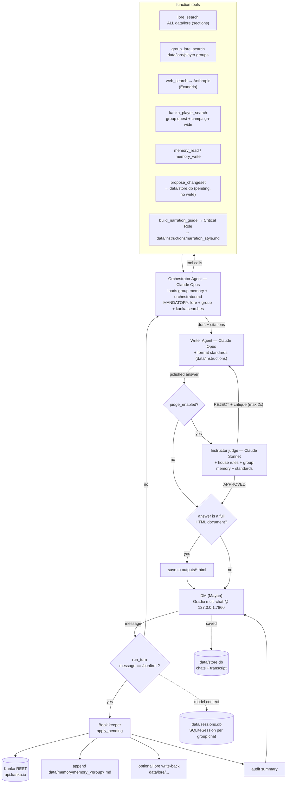

# DM Helper

Single-user Dungeon Master assistant for Mayan. One Orchestrator agent + function tools, an explicit Writer and Instructor judge loop, and confirmation-gated Kanka writes. **Anthropic Claude only**, routed through LiteLLM on the OpenAI Agents SDK. Kanka REST is the canonical campaign store; lore is section-scoped keyword search over markdown (no RAG, no embeddings). Multiple saved chats per group, resumable across restarts.

## Worlds & sources (kept separate)

- **Alaxya** — Mayan's homebrew world. Local markdown in `data/lore/alaxya/` (Deities, History, Geography, the Seven Espada, world events).
- **Player groups** — one backstory file per group in `data/lore/player groups/` (e.g. `Noir_ Players.md`).
- **Exandria** — Critical Role setting. Pulled from the web via Anthropic's native `web_search`. Never treated as Alaxya canon.

`lore_search` searches the **whole** `data/lore` tree (world lore + every group file) so world events, locations, creatures, deities, and cross-world plot (e.g. an Alaxya→Exandria invasion) always surface — even for an Exandria-set group. `group_lore_search` returns a single group's whole backstory. `kanka_player_search` walks the group's quest **and** runs a campaign-wide entity/NPC search that also covers the other groups.

For storytelling **voice** (not canon), `build_narration_guide` distils a Matt Mercer narration/storytelling/dialogue guide from a few Critical Role transcripts into `data/instructions/narration_style.md`. That guide steers the Writer and is enforced by the Instructor when you write or finalize a story — style only, never imported into Alaxya canon.

## Stack

- Python 3.11+, managed with [uv](https://docs.astral.sh/uv/)
- `openai-agents[litellm]` — agent framework, `Runner`, `SQLiteSession`
- `anthropic` SDK — native `web_search` server tool + startup preflight
- `gradio` — local multi-chat UI
- `httpx` + `tenacity` — Kanka + Critical Role clients (429-aware backoff)
- `pydantic` + `pydantic-settings` — typed config + changeset validation
- `python-frontmatter` — Alaxya lore category tags

Every model call routes to Claude via `LitellmModel`. Tracing is **disabled by default** at import; it turns on only if you set `OPENAI_API_KEY` (used solely to upload traces to your OpenAI dashboard — not for any model call).

## Flow



Any model-call failure (bad key, no credit, rate limit) is caught and returned as a clean chat message instead of a stack trace.

## How a turn flows (text)

1. **`/confirm`** short-circuits everything → the book keeper applies the queued Kanka changeset (see below) and returns an audit summary.
2. Otherwise the **Orchestrator** (Claude Opus) loads the active group's rolling memory + `prompts/orchestrator.md` and runs the **mandatory retrieval protocol** — `lore_search` (all lore), `group_lore_search` (active group), and `kanka_player_search` (group quest + campaign-wide) — before producing a cited draft. It never claims a source is empty without calling the tool.
3. The draft goes to the **Writer** (Claude Opus, no tools), which polishes it and carries the conditional output-format standards (session document / feat HTML, narration guide).
4. If `DMHELPER_JUDGE_ENABLED=true` (default), the **Instructor** (Claude Sonnet) reviews the draft against `prompts/instructions.md`, the format standards, **and the group's rolling memory** (to reject answers that contradict established canon). On `REJECT` the Writer re-runs with the critique — max 2 iterations.
5. If the final answer is a complete HTML document (session write-up or feat), it is saved to `outputs/` with a filename derived from its `<title>`.

## Chats & persistence

The app is a Claude.ai-style multi-chat UI. Two layers persist a conversation:

- **Model context** — the OpenAI Agents `SQLiteSession` (`data/sessions.db`), keyed `group:chat`, holds the message history the model reasons over and auto-resumes it across restarts.
- **UI layer** — a chat registry + transcript (`data/store.db`: `chats`, `chat_messages`) drives the sidebar chat list and renders the visible history.

So you can: keep **many saved chats per group**, click a past chat to **reopen it and continue from where you stopped** while seeing the full history, **New chat** / **Delete chat**, and get chats **auto-titled** from the first message. Open the app in two browser tabs to run two chats at once.

## Kanka write gate

The Orchestrator never writes to Kanka directly. It calls `propose_changeset(group_id, chat_id, items_json)`, which validates items and queues them in `data/store.db` (`pending_changes`), then tells Mayan: `Reply "/confirm" to save`. **Nothing reaches Kanka until `/confirm`.**

On `/confirm`, the book keeper, per item:

1. Looks up `(group_id, local_key)` in `kanka_id_map`. If found → `PUT /<entity_type>/<id>` (no search).
2. Else searches Kanka by name; exact match → update + cache the id.
3. Else creates the entity + caches the id.
4. If the item set `lore_target`, writes the content back into `data/lore/alaxya/` (one file per entity) or appends to the group's `data/lore/player groups/` file.
5. Appends a `## /confirm <timestamp>` block to `data/memory/memory_<group>.md` — the same memory the Orchestrator and Instructor read.

The long-term goal is to drive all markdown content into a fully-populated Kanka site, gated by Mayan's `/confirm`.

## Memory model

One rolling memory file per group: `data/memory/memory_<group>.md`.

- **Written by** the book keeper on `/confirm`.
- **Read by** the Orchestrator (into its instructions each turn) and the Instructor (to check drafts against canon).

## Large lore files (image cleanup)

Rich-text/Google-Docs exports can embed images as base64 data URIs, ballooning a ~40 KB lore file into megabytes. Strip them with:

```bash
uv run python -m dmhelper.maintenance.clean_lore
```

It replaces each embedded image with `(image removed)` across `data/lore/**/*.md` (idempotent). `lore_search` also strips data URIs at load and caches parsed sections by mtime, so even an un-cleaned export never bloats the model context.

## Setup

```bash
uv sync --all-extras
cp .env.example .env
# fill ANTHROPIC_API_KEY, KANKA_API_TOKEN, KANKA_CAMPAIGN_ID
# optional: OPENAI_API_KEY to enable trace export
```

Notes:
- This uses the **Anthropic API** (pay-per-token credits at console.anthropic.com), which is separate from a Claude.ai subscription.
- `web_search` must be enabled for your Anthropic organisation in the Claude Console (Privacy settings).

## Run

```bash
uv run python app.py
```

On launch it prints tracing status and a **preflight** result — `✅ Anthropic API reachable` or a `⚠️` warning (bad key / out of credit) — then serves on `http://127.0.0.1:7860`. Pick a play group; its saved chats appear in the sidebar. Stop with `Ctrl+C`.

## Tests

```bash
uv run pytest
```

Covers: Kanka client (search/list/create, 429 backoff, give-up, non-429 errors); Critical Role client (transcript listing/fetch, markup strip, retry); memory tool; verdict parser; lore tools (all-lore section search, group-file matching, Alaxya/group write-back, base64 stripped from results); lore image cleaner (strip + idempotent); campaign-wide Kanka search; the write gate (unconfirmed write blocked, search-before-write dedupe, cached-id short-circuit, memory append); HTML output emission; format-standards + group-memory injection into Writer/Instructor; narration guide (Matt Mercer emphasis); error classifier + `run_turn` friendly errors + preflight; and the chat store (create/list ordering, transcript round-trip, rename/delete).

## Layout

```
app.py                         # Gradio multi-chat entry; tracing + preflight
src/dmhelper/
    config.py                  # pydantic-settings (.env)
    observability.py           # optional OpenAI trace export
    preflight.py               # startup Anthropic reachability check
    errors.py                  # friendly_error classifier
    orchestrator.py            # per-turn pipeline (+ error wrapping)
    outputs.py                 # detect + save HTML session docs to outputs/
    agents/
        writer.py
        instructor.py
        format_standards.py    # loads data/instructions/*.md
    tools/
        lore.py                # lore_search (all lore, sections), group_lore_search, write-back
        web.py                 # Anthropic web_search wrapper
        kanka_search.py        # kanka_player_search (group + campaign-wide)
        kanka_write.py         # propose_changeset + apply_pending (book keeper)
        memory.py              # memory_read / memory_write
        narration.py           # build_narration_guide (Matt Mercer / Critical Role)
    clients/
        kanka.py               # async httpx + tenacity
        criticalrole.py        # fandom MediaWiki transcript fetch
    maintenance/
        clean_lore.py          # strip base64 images from lore markdown
    store/db.py                # pending_changes, kanka_id_map, chats, chat_messages
data/
    lore/alaxya/               # Alaxya world lore (frontmatter category/world)
    lore/player groups/        # one backstory file per group
    memory/                    # rolling memory_<group>.md (book keeper)
    instructions/              # Session_Tempalte.md, narration_style.md, specs
    sessions.db                # SQLiteSession model context (gitignored)
    store.db                   # chats + transcript + write-gate state (gitignored)
prompts/
    orchestrator.md  writer.md  instructor.md  instructions.md
outputs/                       # generated session-document .html (gitignored)
tests/
```

## Environment

| Variable                       | Default                       | Purpose                                                       |
| ------------------------------ | ----------------------------- | ------------------------------------------------------------ |
| `ANTHROPIC_API_KEY`            | —                             | Routed to every Claude call via LiteLLM.                      |
| `KANKA_API_TOKEN`              | —                             | Bearer token for `api.kanka.io`.                             |
| `KANKA_CAMPAIGN_ID`            | —                             | Campaign id scoping all Kanka requests.                      |
| `OPENAI_API_KEY`               | — (optional)                  | Enables Agents-SDK **trace export** to your OpenAI dashboard. |
| `DMHELPER_TRACING_ENABLED`     | `true`                        | Master toggle for trace export (needs the OpenAI key too).   |
| `DMHELPER_ORCHESTRATOR_MODEL`  | `anthropic/claude-opus-4-8`   | LiteLLM model string for the Orchestrator.                   |
| `DMHELPER_WRITER_MODEL`        | `anthropic/claude-opus-4-8`   | LiteLLM model string for the Writer.                         |
| `DMHELPER_JUDGE_MODEL`         | `anthropic/claude-sonnet-4-6` | LiteLLM model string for the Instructor judge.               |
| `DMHELPER_WEB_MODEL`           | `claude-sonnet-4-6`           | Native Anthropic model id for `web_search` + preflight.      |
| `DMHELPER_NARRATION_MODEL`     | `claude-opus-4-8`             | Native Anthropic model id for distilling the narration guide. |
| `DMHELPER_NARRATION_SAMPLE`    | `3`                           | How many CR transcripts to sample per guide build.           |
| `DMHELPER_NARRATION_EXCERPT_CHARS` | `6000`                    | Per-transcript excerpt length fed to the distiller.          |
| `DMHELPER_JUDGE_ENABLED`       | `true`                        | Set `false` to skip the judge loop (cheaper).                |
| `DMHELPER_DATA_DIR`            | `data`                        | Base dir for lore, memory, instructions, SQLite stores.      |
| `DMHELPER_OUTPUTS_DIR`         | `outputs`                     | Where generated HTML session documents are saved.            |

## Cost note

Every turn runs Opus (Orchestrator + Writer) plus the Sonnet judge and the mandatory searches, so it is token-heavy. To stretch API credits, set the model vars to `anthropic/claude-sonnet-4-6` and/or `DMHELPER_JUDGE_ENABLED=false`.
